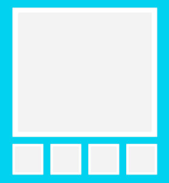

# Cat page 🙀

Sviluppare una pagina web che mostri una galleria di immagini.
Le immagini visualizzate dovranno essere contenute in un contenitore non più grande di 200px (saranno quindi delle anteprime).
Cliccando su una delle anteprime bisognerà mostrare la stessa immagine sul contenitore più grande (vedi wireframe sotto).

Ovviamente le immagini saranno più di quelle riportate nel wireframe, quindi trovate voi un modo per disporle.

La prima immagine selezionata sarà la prima della lista di anteprime.



## Requisiti

Al caricamento della pagina fare una chiamata http in `GET` a questo endpoint: `https://api.thecatapi.com/v1/breeds` aggiungendo questo questo header: `'x-api-key': '78548d1d-d031-4322-95c7-877bd83d7a10'`.

Se la chiamata è andata a buon fine riceverete un JSON simile a questo:

```json
[
    {
        "weight": {
            "imperial": "7  -  10",
            "metric": "3 - 5"
        },
        "id": "abys",
        "name": "Abyssinian",
        "cfa_url": "http://cfa.org/Breeds/BreedsAB/Abyssinian.aspx",
        "vetstreet_url": "http://www.vetstreet.com/cats/abyssinian",
        "vcahospitals_url": "https://vcahospitals.com/know-your-pet/cat-breeds/abyssinian",
        "temperament": "Active, Energetic, Independent, Intelligent, Gentle",
        "origin": "Egypt",
        "country_codes": "EG",
        "country_code": "EG",
        "description": "The Abyssinian is easy to care for, and a joy to have in your home. They’re affectionate cats and love both people and other animals.",
        "life_span": "14 - 15",
        "indoor": 0,
        "lap": 1,
        "alt_names": "",
        "adaptability": 5,
        "affection_level": 5,
        "child_friendly": 3,
        "dog_friendly": 4,
        "energy_level": 5,
        "grooming": 1,
        "health_issues": 2,
        "intelligence": 5,
        "shedding_level": 2,
        "social_needs": 5,
        "stranger_friendly": 5,
        "vocalisation": 1,
        "experimental": 0,
        "hairless": 0,
        "natural": 1,
        "rare": 0,
        "rex": 0,
        "suppressed_tail": 0,
        "short_legs": 0,
        "wikipedia_url": "https://en.wikipedia.org/wiki/Abyssinian_(cat)",
        "hypoallergenic": 0
    }
]
```

Di questi dati servirà soltanto **name** e **description**, da mostrare sul contenitore più grande (impostatelo graficamente come preferite: l'importante è che queste informazioni stiano dentro il contenitore) dopo aver selezionato l'anteprima.

# Regole

- No framework js/css
- Non vale creare elementi stringati:
    ```js
    // NO NO NO 🚓
    var img = '<div></div>';

    // SI 👌
    const imgContainer = document.createElement('figure');
    imgContainer.onclick = function() {
        // cose
    }

    const img = document.createElement('img');
    img.src = "img.png"
    imgContainer.appendChild(img) // output: <div></div>
    ```

    Per creare gli elementi usate le funzioni apposite `document.createElement` (https://developer.mozilla.org/en-US/docs/Web/API/Document/createElement) appendendo gli elementi (https://developer.mozilla.org/en-US/docs/Web/API/Node/appendChild).

- Usate `fetch`
- Scrivete es6: niente più `var`. Parcel dietro le quinte farà il transpile del vostro codice per renderlo retrocompatibile.
- Opzionale: usate le high order function come `.map` per gli array

# Istruzioni
Installate le dipendenze da CLI:

`npm install`

Avviate parcel: 

`npm start`
